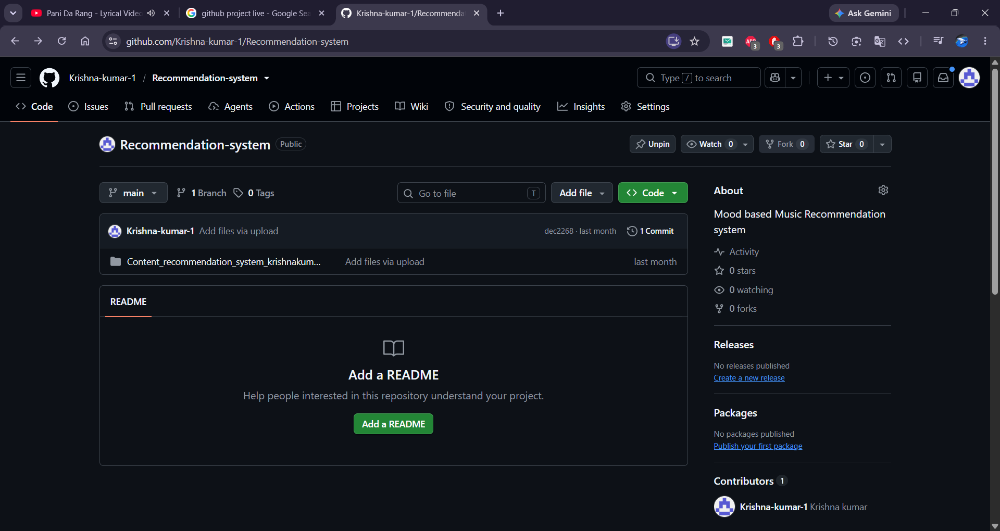

# 🎵 Mood-Based Music Recommendation System

Real-time facial-emotion and hand-gesture detection that recommends music based on how you're actually feeling — built with MediaPipe, OpenCV, and a Keras neural network.




---

## 📌 Overview

This project captures facial landmarks and hand gestures live from your webcam using **MediaPipe Holistic**, then classifies your emotional state (happy, sad, energetic, shocked, surprised, etc.) with a **dense neural network** trained on your own recorded data. The predicted mood can then be mapped to a music/playlist recommendation.


## ✨ Features

- **Real-time detection** — face + both hands tracked live via webcam, no external sensors needed
- **Custom-trained model** — trained on your own gesture/expression data, not a generic pretrained dataset
- **Lightweight architecture** — simple 2-layer dense network (512 → 256 → softmax), trains in seconds
- **Fully offline** — everything runs locally, no cloud API calls

## 🗂️ Project Structure

```
mood-music-recommender/
├── data_collection.py     # Step 1: record labeled samples from your webcam
├── train.py                # Step 2: train the classifier on recorded data
├── inference.py             # Step 3: run live emotion detection
├── model.h5                 # Pretrained model (ready to use out of the box)
├── labels.npy                # Class labels for the pretrained model
├── data/                       # Sample recorded gesture/emotion data (.npy)
├── assets/                       # Images used in this README
├── requirements.txt
└── setup.sh                        # one-click environment setup
```

## 🚀 Quick Start (one-click setup)

```bash
git clone https://github.com/<your-username>/mood-music-recommender.git
cd mood-music-recommender
chmod +x setup.sh && ./setup.sh
```

This creates a virtual environment and installs every dependency in `requirements.txt`. Then activate it:

```bash
source venv/bin/activate
```

### Try it immediately with the pretrained model

```bash
python inference.py
```

Press **Esc** to quit the webcam window.

## 🏗️ Train on your own data (optional)

Want the model to recognize *your* expressions instead of the bundled ones?

1. **Collect data** — record ~100 frames per emotion:
   ```bash
   python data_collection.py
   # Enter a label when prompted, e.g. "happy", "sad", "energy"
   # Repeat for each mood you want to detect
   ```
2. **Train** the model on everything inside `data/`:
   ```bash
   python train.py
   ```
   This produces a fresh `model.h5` and `labels.npy` in the project root.
3. **Run inference** as above — it will now use your newly trained model.

## 🧠 How It Works

1. MediaPipe Holistic extracts 468 face landmarks + 21 landmarks per hand from each webcam frame.
2. Landmarks are normalized relative to a reference point (nose tip for face, index fingertip for hands) so the model is position-invariant.
3. The flattened landmark vector is fed into a dense neural network that outputs a softmax probability over emotion classes.
4. The predicted class label can be mapped to a corresponding music genre/playlist.

## 🛠️ Tech Stack

| Component | Library |
|---|---|
| Landmark detection | MediaPipe Holistic |
| Video capture | OpenCV |
| Model training/inference | TensorFlow / Keras |
| Data handling | NumPy |

## 📋 Requirements

- Python 3.9+
- A webcam
- See `requirements.txt` for exact package versions

## 🤝 Contributing

Issues and pull requests are welcome — feel free to fork and extend this with actual music-streaming API integration (Spotify/YouTube Music).

## 📄 License

Licensed under the [MIT License](LICENSE).
